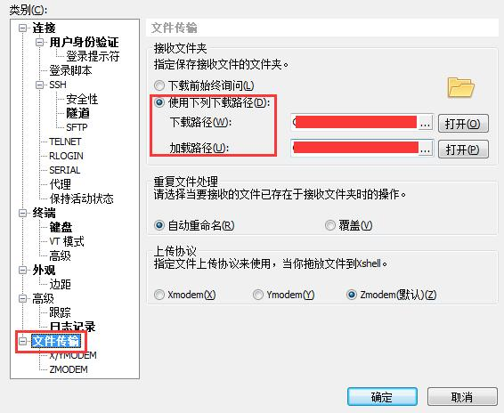

### 在xshell新建的连接上，先做以下设置

### 安装工具
登陆VPS后，如果是centos系列，运行以下命令：
yum install -y lrzsz

### 从本地上传文件到VPS
运行以下命令：

rz

输入rz命令后，会弹出对话框，选择你要上传的文件，选择打开就上传到Linux主机。上传完可以使用ls 查看

### 从VPS下载文件到本地
从Linux主机下载文件，下载命令为sz ，后面跟要下载的文件名；可以选择下载的保存文件夹：

sz xxx.test

